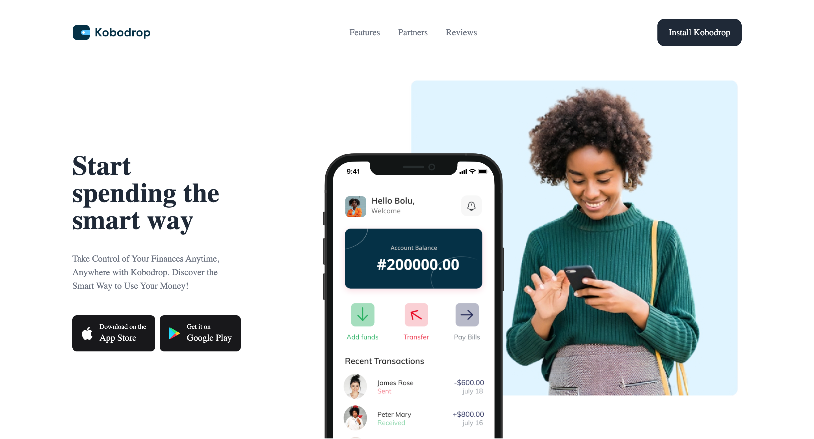

# Kobodrop

[](https://kobo-drop.vercel.app/)

**Kobodrop** is a dynamic landing page that empowers you to take control of your finances anytime, anywhere. Discover the smart way to manage your money with Kobodrop.

## Features

- **Smart Financial Management**: Tools and insights to help you manage your money efficiently.
- **Accessible Anywhere**: Use Kobodrop from any device, anytime.
- **User-Friendly Design**: Intuitive layout inspired by modern UI principles.

## Getting Started

### Installation

1. **Clone the repository:**

   ```bash
   git clone https://github.com/your-username/kobodrop.git
   cd kobodrop
   ```

2. **Install the dependencies:**

   ```bash
   npm install
   ```

3. **Run the development server:**
   ```bash
   npm run dev
   ```
   Open [http://localhost:3000](http://localhost:3000) to view it in the browser. The app will automatically reload if you make edits.

### Contributing

- Fork the repository
- Create a branch
  ```bash
  git checkout -b fix/amazingFix
  ```
- Commit your changes and push to your branch
  ```bash
  git commit -m "made an amazingFix"
  git push origin fix/amazingFix
  ```
- Open a pull request

## License

Distributed under the MIT License. See `LICENSE` for more information.
